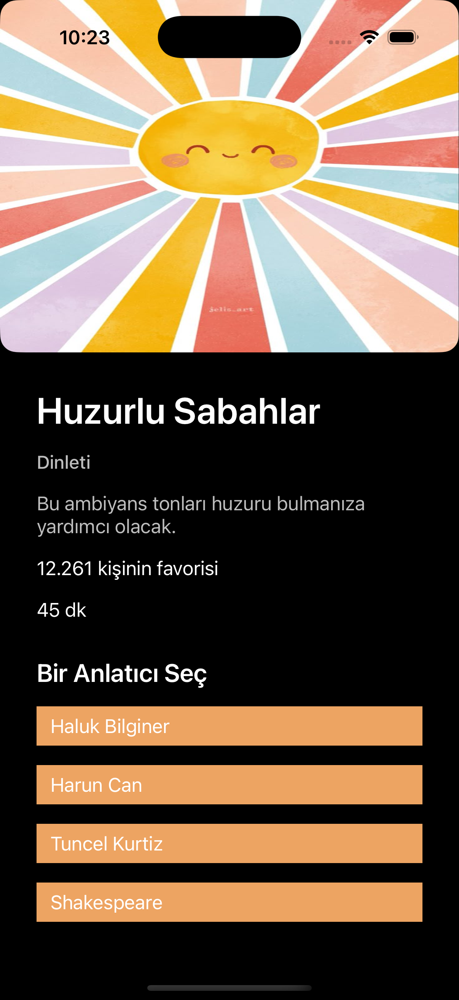

<h1>🧘🏻‍♀️Meditation App Design</h1>

This is a single-screen iOS meditation app design created as part of a UI/UX improvement project. It features a minimal interface, dark/light mode compatibility, multilingual support, and personalized theming.

<h2>Project Goals</h2>
<ul>
  <li>Recreate a pick a narrator screen inspired by modern UI designs</li>
  <li>Apply Auto Layout and Stack Views effectively</li>
  <li>Add support for light and dark modes</li>
  <li>Enable customization with Turkish and English language </li>
</ul>
<h2>🎨Inspiration Source and Reference Design</h2>
<a href="https://www.figma.com/community/file/882888114457713282">Figma Meditation App Design</a>

<h2>Screenshots</h2>

<strong>English UI</strong>

 

  &nbsp;&nbsp;&nbsp;&nbsp;&nbsp;&nbsp;
  

<strong>Turkish UI</strong>

  &nbsp;&nbsp;&nbsp;&nbsp;&nbsp;&nbsp;
  

<h2>🛠️Features</h2>
<ul>
  <li>Dark and light mode support</li>
  <li>Localization for English and Turkish</li>
  <li>Custom colors and color palette</li>
  <li>Responsive layout using Auto Layout and Stack Views</li>
</ul>
<h2>💻Tech Stack</h2>

This project was built using Xcode 15+ and UIKit with Storyboard for iOS 18.2+. No third-party libraries were used — fully native.

